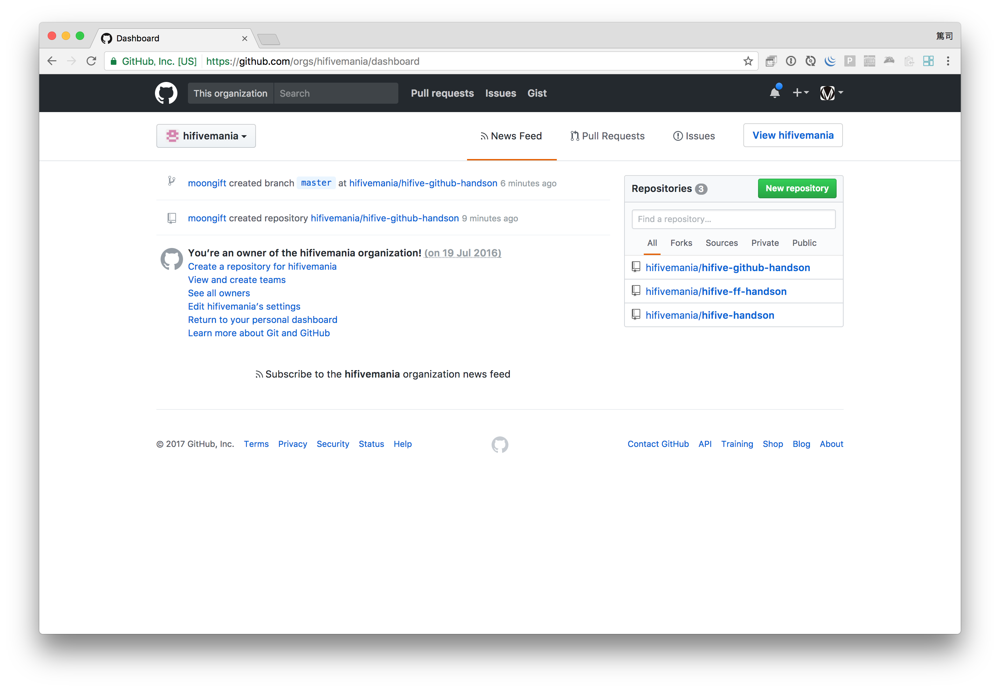
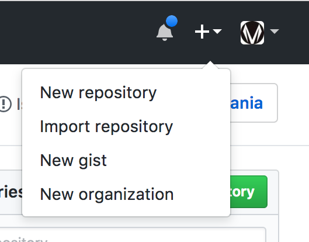
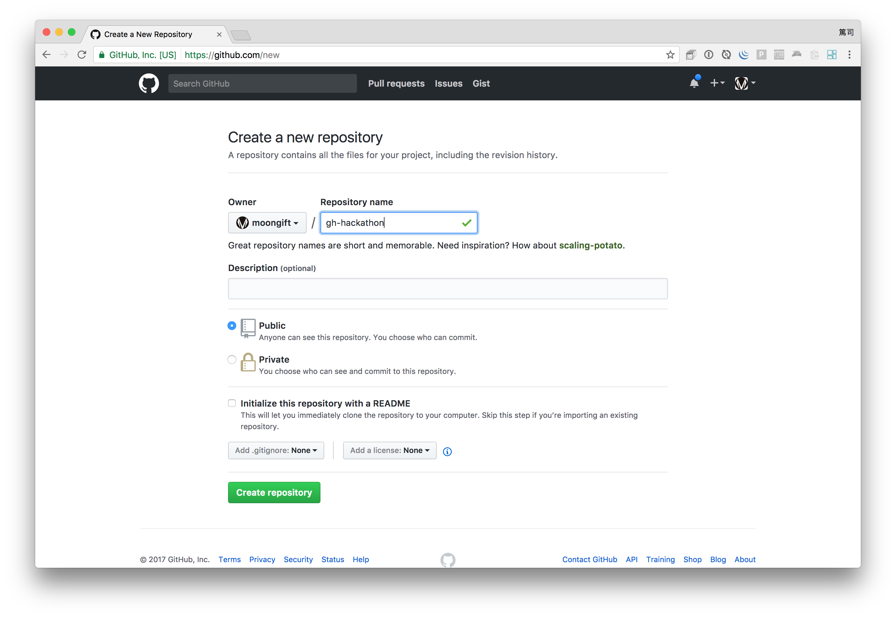
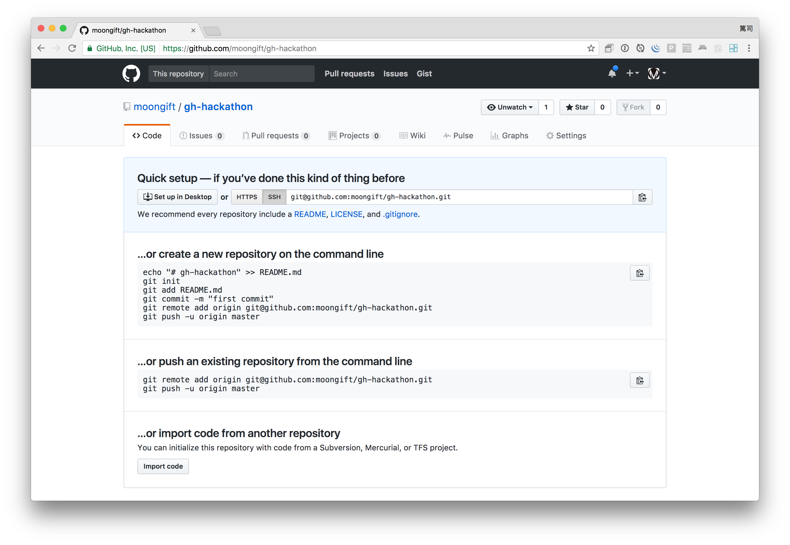
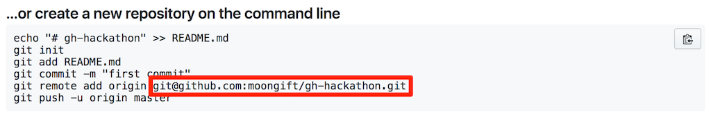
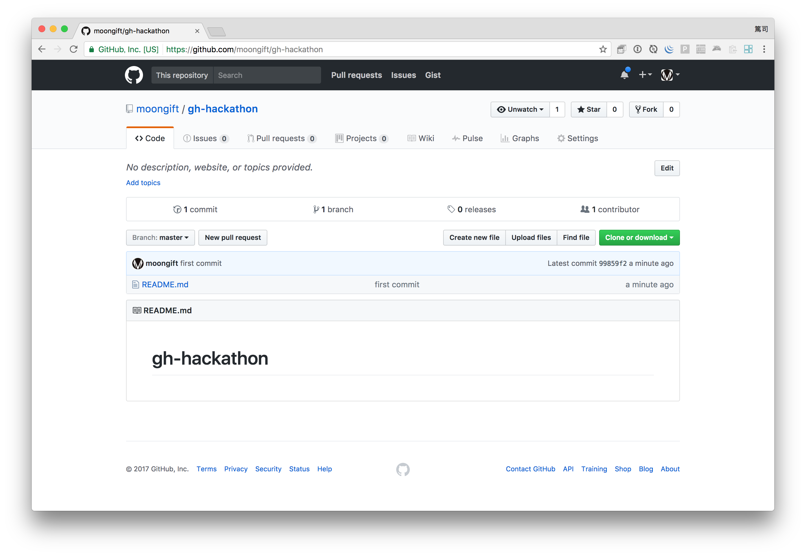

# リポジトリを作成しよう

まず最初にGitHubでリポジトリを作ってみましょう。以下はログインした際のダッシュボードの画面です。



右上のプラスアイコンをクリックします。その中にある New Repositoryをクリックしてください。



そうすると新しいリポジトリを作成する画面が出ますので、Repository Nameを入力します。名前は適当で構いませんが、覚えやすいものにしましょう。今回は gh-hackathon と入力したとします。



入力したら Create Repositoryボタンをクリックします。そうすると以下の画面のようにセットアップに関する情報が出ます。



GitHub上で行う作業は一旦ここまでで、次はローカルコンピュータ上での作業になります。

## ローカルコンピュータでの作業について

まず最初に適当なディレクトリ/フォルダを作成します。そしてその中に移動します。

```
$ mkdir gh-hackathon
$ cd gh-hackathon/
```

### リポジトリの初期化

ここからGitリポジトリの初期化を行います。まず適当なファイルを作成します。

```
$ echo "# gh-hackathon" >> README.md
```

そしてGitコマンドのinitオプションを使って初期化します。

```
$ git init
Initialized empty Git repository in /path/to/gh-hackathon/.git/
```

そうすると .git ディレクトリが作成されます。これは不可視フォルダなので見えない環境の方もいるかも知れません。

そして先ほど作成したファイルをaddオプションを使って追加します。

```
$ git add README.md
```

この段階ではまだ仮追加の状態なので、commit を使って確定させます。 -m の後にはコミット時のメッセージを入力します。

```
$ git commit -m "first commit"
[master (root-commit) 99859f2] first commit
 1 file changed, 1 insertion(+)
 create mode 100644 README.md
```

## GitHubにリポジトリを同期する

ここまでの作業ではまだローカルとGitHubとで同期が取られていません。そこでGitHubリポジトリのURLを登録します。このURLは皆さん異なるので注意してください。先ほど登録したGitHubのリポジトリ画面でURLは確認できます。

```
$ git remote add origin git@github.com:moongift/gh-hackathon.git
```



そして最後にpushオプションを使ってローカルのリポジトリデータをGitHubに送信します。

```
$ git push -u origin master
Counting objects: 3, done.
Writing objects: 100% (3/3), 232 bytes | 0 bytes/s, done.
Total 3 (delta 0), reused 0 (delta 0)
To git@github.com:moongift/gh-hackathon.git
 * [new branch]      master -> master
Branch master set up to track remote branch master from origin.
```

これで完了です。先ほどのGitHubの画面を再読込すると、リポジトリの内容に変わっているのが確認できるかと思います。



----

ここまででGitHubリポジトリの登録が完了です。また、ごく基本的なリポジトリ操作を習得しました。

1. addオプションでファイルの変更（新規作成、修正、削除含む）を仮登録
1. commitオプションでローカルリポジトリに反映
1. pushオプションでリモートリポジトリへ反映

基本的にこの流れでリポジトリを操作します。

## では次はhifiveについて軽く触ってみましょう。[資料2](./2.md)へ進んでください。
