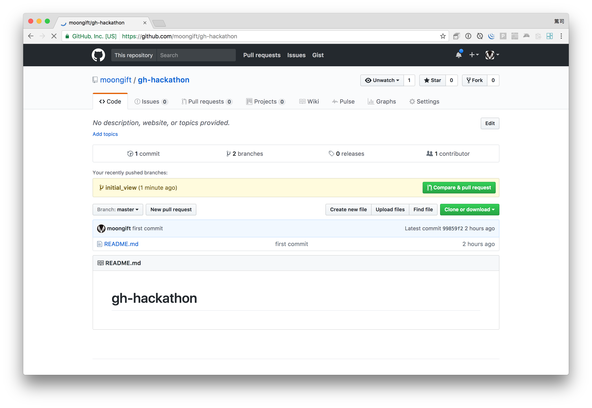
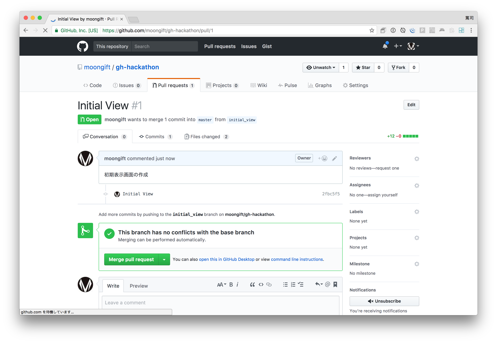
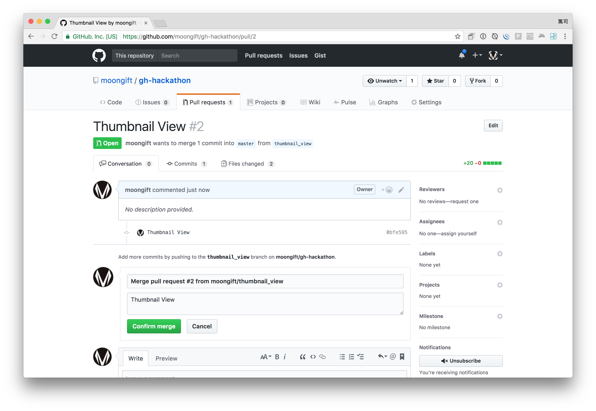
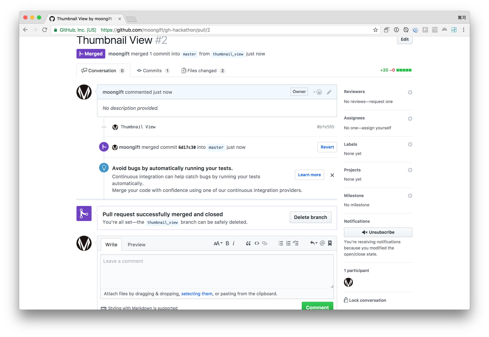

# 日報アプリを作る（その3）「初期表示を作成する」

前回に続いて日報アプリを作っていきます。今回からhifiveを使っていきます。今回は初期表示を作成します。

## ブランチを作成する

Gitリポジトリで作業する場合、masterブランチを直接操作するのはよくありません。まずブランチを作成してから作業します。

```
$ git checkout -b initial_view
```

checkoutオプションはブランチを切り替えるためのコマンドです。-bでブランチ名を付けることで、新しいブランチを作成しながらブランチを切り替えてくれます。ブランチが正しく切り替わっているかはbranchオプションで確認できます。

```
$ git branch
* initial_view
  master
```

*印がついていますので現在のブランチはinitial_viewになります。

## デフォルトの日付を表示する

初期表示をサーバサイドでレンダリングされるHTMLだけで済ませることもありますが、JavaScriptを使うことでもっとインタラクティブに、かつ軽量に実装ができるようになります。

今回は日付、時刻に現在の日時を表示するようにしてみたいと思います。

## index.jsの修正

js/index.jsを開いて、__ready の内容を修正します。

**修正前：**

```
__ready: function() {
},
```

**修正後：**

```
__ready: function() {
  this.$find('input[name="reportDate"]').val(
    handson.utils.formatDateWithHyphen(new Date())
  );
},
```

hifiveは `this.$find` で jQueryの `$(".class")` と同じように使えます。つまり、この場合はinputタグのnameがreportDateであるコンポーネントに対して、  `handson.utils.formatDateWithHyphen` を実行しています。

修正後、ブラウザを再読み込みすると、日付が自動入力されているのが確認できるはずです。

では続いて時間についても処理を書いてみましょう。まず勤務開始時間ですが、09:00とします。

```
__ready: function() {
  // 省略
  this.$find('input[name="startTime"]').val('09:00');
},
```

続いて勤務終了時間ですが、これは現在時刻から動的に作りたいと思います。そこで、日付と同じようにhandson.utilsを使います。utils.jsを修正します。

**元：**

```
  h5.u.obj.expose('handson.utils', {
    formatDateWithHyphen: function(date) {
        var y = date.getFullYear();
        var m = date.getMonth() + 1;
        var mStr = m < 10 ? '0' + m : m.toString();
        var d = date.getDate();
        var dStr = d < 10 ? '0' + d : d.toString();
        return h5.u.str.format('{0}-{1}-{2}', y, mStr, dStr);
    }
  });
```

**修正後：**

```
  h5.u.obj.expose('handson.utils', {
    formatDateWithHyphen: function(date) {
        var y = date.getFullYear();
        var m = date.getMonth() + 1;
        var mStr = m < 10 ? '0' + m : m.toString();
        var d = date.getDate();
        var dStr = d < 10 ? '0' + d : d.toString();
        return h5.u.str.format('{0}-{1}-{2}', y, mStr, dStr);
    },  // ←カンマを忘れずに！
    
    formatTime : function (date) {
        var h = date.getHours();
        var m = date.getMinutes();
        return (h < 10 ? '0' : '') + h + ':' + (m < 10 ? '0' : '') + m;
    }
  });
```

これで formatTime というメソッドが追加されました。では index.jsを修正します。

**元：**

```
__ready: function() {
	this.$find('input[name="reportDate"]').val(
		handson.utils.formatDateWithHyphen(new Date())
	);
	this.$find('input[name="startTime"]').val('09:00');
},
```

**修正後：**

```
__ready: function() {
	this.$find('input[name="reportDate"]').val(
		handson.utils.formatDateWithHyphen(new Date())
	);
	this.$find('input[name="startTime"]').val('09:00');
	this.$find('input[name="endTime"]').val(
		handson.utils.formatTime(new Date())
  );
},
```

修正した後、再読み込みすると日付と開始時間、終了時間が入っているのが確認できるかと思います。


## Gitにコミットする

ではここまでの修正内容を確認しましょう。diffオプションを使います。以下のように出力されると思います。これで自分で行った変更が簡単に確認できます。

```
$ git diff
diff --git a/js/index.js b/js/index.js
index 5ed7a8e..044474e 100755
--- a/js/index.js
+++ b/js/index.js
@@ -3,6 +3,12 @@
                __name: 'handson.ReportController',
 
                __ready: function() {
+                       this.$find('input[name="reportDate"]').val(
+                               handson.utils.formatDateWithHyphen(new Date())
+                 );
+                       this.$find('input[name="startTime"]').val('09:00');
+                       this.$find('input[name="endTime"]').val(
+                               handson.utils.formatTime(new Date()));
                },
                
                'input, textarea focusout': function(context, $el) {
diff --git a/js/util.js b/js/util.js
index 6f74f55..480d4cf 100755
--- a/js/util.js
+++ b/js/util.js
@@ -7,6 +7,12 @@
         var d = date.getDate();
         var dStr = d < 10 ? '0' + d : d.toString();
         return h5.u.str.format('{0}-{1}-{2}', y, mStr, dStr);
+    },  // ←カンマを忘れずに！
+    
+    formatTime : function (date) {
+        var h = date.getHours();
+        var m = date.getMinutes();
+        return (h < 10 ? '0' : '') + h + ':' + (m < 10 ? '0' : '') + m;
     }
   });
```

確認したらコミットします。追加のファイルがない場合は -a が使えます。

```
$ git commit -a -m "Initial View"
[initial_view 2fbc5f5] Initial View
 2 files changed, 12 insertions(+)
```

次にこの内容をGitHubに反映します。今回はorigin（リモート）に対してinitial_view（ブランチ）の内容を反映します。

```
$ git push origin initial_view
Counting objects: 29, done.
Delta compression using up to 8 threads.
Compressing objects: 100% (29/29), done.
Writing objects: 100% (29/29), 484.98 KiB | 0 bytes/s, done.
Total 29 (delta 7), reused 0 (delta 0)
remote: Resolving deltas: 100% (7/7), done.
To git@github.com:moongift/gh-hackathon.git
 * [new branch]      initial_view -> initial_view
```

終わったらGitHubのリポジトリを見てみましょう。ブランチの情報が上がっているはずです。



この変更内容を取り込むので、Compare & pull requestボタンをクリックします。


Pull Requestを作成する画面ではどういった変更であるかを入力してCreate pull requestを押してください。今回は変更が簡単なものなので Able to merge と表示されています。もしmasterとブランチの間に齟齬があった場合はあらかじめマージする必要があります（今回のハンズオンでは行いません）。


Pull Requestを作成したらMerge pull requestをクリックします。



ログメッセージを記述し（必要があれば）、Confirm mergeボタンをクリックします。



これでinitial_viewブランチで作成した内容がmasterブランチに反映されました。ブランチは削除しても大丈夫です（Delete branchボタンをクリックします）。



## masterに反映する

ではローカルのリポジトリでも変更内容を反映してみましょう。まずmasterブランチに戻ります。

```
$ git checkout master
```

pullオプションを使ってoriginからの内容を取り込みます。

```
$ git pull
remote: Counting objects: 1, done.
remote: Total 1 (delta 0), reused 0 (delta 0), pack-reused 0
Unpacking objects: 100% (1/1), done.
From github.com:moongift/gh-hackathon
   b87f93e..53ebdc9  master     -> origin/master
Updating b87f93e..53ebdc9
Fast-forward
 js/index.js | 6 ++++++
 js/util.js  | 6 ++++++
 2 files changed, 12 insertions(+)
```

以下の手順で反映されたのが分かるかと思います。

1. ローカル（initial_viewブランチ）からリモート（initial_viewブランチ）へ反映
2. リモート上でマージ（initial_viewからmasterブランチへ）
3. リモート（master）からローカル（master）へ反映

GitHubではこのようなフローで運用を行います。

----

このようにhifiveでは __ready 部分を使って初期表示時の処理を書きます。コードが散らばることなく一カ所にまとめられるのが利点かと思います。

今回のコードは[hifive-github-handson/4 at master · hifivemania/hifive-github-handson](https://github.com/hifivemania/hifive-github-handson/tree/master/5)にて確認できます。また、[実際に動いているデモはこちらのURL](https://hifivemania.github.io/hifive-github-handson/5/)にて確認できます。

では次は[日報アプリを作る（その4）「入力チェックをする」](6.md)でイベント処理を作っていきます。


