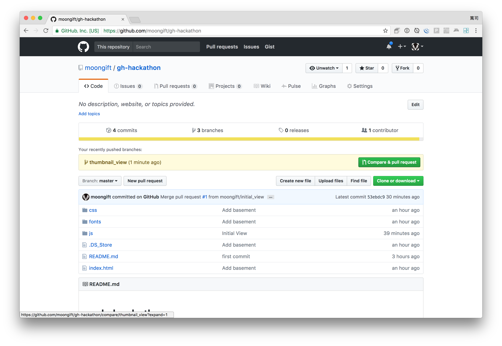

# 日報アプリを作る（その5）「画像のサムネイルを表示する」

引き続き日報アプリを作っていきます。今回は画像を指定した時に、サムネイルを表示する処理を作っていきます。

HTML5で追加されたFile APIを使うことで、ユーザが指定したファイルの中身を読み取れるようになります。画像データの読み取りにはFileReaderクラスを使用します。

## ブランチを作成する

今回も前回同様にブランチを作るところからはじめます。

```
$ git checkout -b thumbnail_view
```

## index.htmlの修正

まずプレビュー画像の表示場所を作成します。フォームの画像選択の下に設置します。

**元：**

```
<div class="col-sm-11 img-input-wrap">
    <input class="form-control" accept="image/*" name="img" type="file"/>
</div>
```

**修正後：**

```
<div class="col-sm-11 img-input-wrap">
    <input class="form-control" accept="image/*" name="img" type="file"/>
    <!-- 追加 -->
    <div class="img-preview"></div>
</div>
```

## 処理を書く

処理としては index.js の次の部分になります。ファイルを指定した＝changeとしてイベントが実行されます。

```
'input[name="img"] change': function(context, $el) {
},
```

今回もまずコメントだけ記述します。

```
'input[name="img"] change': function(context, $el) {
	// 変数の定義
	
	// input要素からファイルを取得
	
	// FileReaderインスタンスの作成
	
	// ファイルが読み込まれた時の処理を記述
		// 画像を表示
		
	// ファイル読み込み開始
},
```

では順番に作っていきます。

### 変数の定義

今回使うのは画像表示を行うDOM部分になります。

```
// 変数の定義
var $imgPreview = this.$find('.img-preview');
```

### input要素からファイルを取得

これは$elを使って行います。

```
// input要素からファイルを取得
var file = $el[0].files[0];
```

### FileReaderインスタンスの作成

FileReaderクラスは次のように使います。

```
// FileReaderインスタンスの作成
var reader = new FileReader();
```

### ファイルが読み込まれた時の処理を記述

今回はここが一番難しい部分ですが、FileReaderクラスで実際にファイルが読み込まれると、onloadというイベントが呼び出されます。そこで、次のように記述します。

```
// ファイルが読み込まれた時の処理を記述
reader.onload = function(e) {
	// 画像を表示
	$imgPreview.find('img').attr('src', e.target.result);
	$imgPreview.show();
};
```

変数eの中にファイルの内容が入ってきますので、それをimgタグのsrcに対して適用します。

### ファイル読み込み開始

一見すると順番が逆に感じるのですが、先に onloadの処理を定義しておかないと、読み込み開始した時の呼び出し先がない状態になります。onloadを定義した後、画像の読み込みを行います。

```
// ファイル読み込み開始
reader.readAsDataURL(file);
```

これで一通りの処理が完了です。全体としては次のようになります。これで画像のサムネイル表示ができるようになります。

```
'input[name="img"] change': function(context, $el) {
	// 変数の定義
	var $imgPreview = this.$find('.img-preview');
	
	// input要素からファイルを取得
	var file = $el[0].files[0];
	
	// FileReaderインスタンスの作成
	var reader = new FileReader();
	
	// ファイルが読み込まれた時の処理を記述
	reader.onload = function(e) {
		// 画像を表示
		$imgPreview.find('img').attr('src', e.target.result);
		$imgPreview.show();
	};
	// ファイル読み込み開始
	reader.readAsDataURL(file);
},
```

実際に画像を指定して確認してください。

## Gitにコミットする

作業が終わったらまずdiffオプションで内容を確認します。次のように出力されればOKです。

```
$ git diff
diff --git a/index.html b/index.html
index 08dcbe2..677d0b7 100755
--- a/index.html
+++ b/index.html
  // 省略
+			reader.readAsDataURL(file);
 		},
 
 		'.confirm click': function(context, $el) {
```

問題なければコミットします。今回も新規ファイルはないので -a を使います。

```
$ git commit -a -m "Thumbnail View"
```

そしてGitHubへプッシュします。

```
$ git push origin thumbnail_view
```

終わったらGitHubのリポジトリページへ行き、作成されているブランチからPull Requestを作成、masterブランチへマージします。



マージが終わったらローカルブランチをmasterに変更し、リモート上でのマージを反映します。

```
$ git checkout master
$ git pull
```

----

今回はHTML5のFileReaderを使って画像をアップロード前に確認する処理を作成しました。画像の種類を調べたり、サイズのチェック、Canvasタグを使って縮小なども実現できます。よりリッチなWebアプリケーションを作る上で必須のAPIと言えるのではないでしょうか。

今回のコードは[hifive-gihub-handson/7 at master · hifivemania/hifive-gihub-handson](https://github.com/hifivemania/hifive-hgihub-andson/tree/master/7)にて確認できます。また、[実際に動いているデモはこちらのURL](https://hifivemania.github.io/hifive-gihub-handson/7/)にて確認できます。

今回のハンズオンではここまでとなります。以下はお時間が余った方向けへのオマケと考えてください。

では次は[日報アプリを作る（その6）「テンプレートを活用する」](8.md)でHTMLを描画する処理を作ってみたいと思います。
